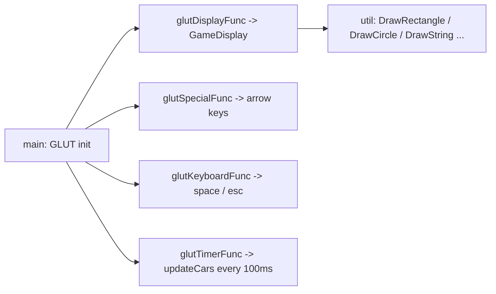

# Rush Hour 2D Taxi Game (C++ / OpenGL)

> A 2D arcade driving game built with **OpenGL / GLUT**: drive a taxi around a city grid, pick up passengers, and drop them at their destination for points while traffic keeps moving.


The map is a tiled city with buildings, trees, obstacle boxes and a roundabout. Cars patrol fixed routes on a timer while you drive the red taxi, collect the stick-figure passengers, and deliver each one to their own destination to score.

## Gameplay & Features

- 🚕 **Drive the taxi** around a tiled city map
- 🧍 **Pick up a passenger**, then a green marker shows *their* destination — deliver them for **+10 score**
- 🚗 **Patrolling traffic** — cars follow looping waypoint paths (timer-driven)
- 🌳 **Static world** — buildings, trees, obstacle boxes, a roundabout
- 🟢 **Score HUD**

---

## Controls

| Action | Input |
|--------|-------|
| Move taxi | Arrow keys (← ↑ → ↓) |
| Pick up / drop off | `Spacebar` |
| Quit | `Esc` |

Pull up next to a waiting passenger and press **Space** to pick them up; their destination marker then appears. Drive onto it and press **Space** again to drop them off and score.

---

## How It Works



`game.cpp` holds the game logic — the taxi, waypoint-driven traffic, passengers and their destinations, scoring, and rendering. `util.h` / `util.cpp` provide the drawing primitives over GLUT/OpenGL.

---

## Build & Run

```bash
bash install-libraries.sh   # Debian/Ubuntu: freeglut, GLEW, OpenGL, X11, FreeImage
make                        # builds the 'game' binary
./game
```

Builds on **Linux/X11** out of the box; `util.h` also guards the Windows and macOS GL headers (see `SETUP.md`).

---

## Project Structure

```
game.cpp              Game logic: taxi, traffic, passengers/destinations, scoring, rendering
util.h / util.cpp     Drawing primitives (shapes, text, colours) over GLUT/OpenGL/CImg
CImg.h                Bundled single-header image library
Makefile              Build (compiles util.cpp + game.cpp -> game)
install-libraries.sh  Installs the graphics dependencies
SETUP.md              Per-platform build notes
```

---

## Author

**Muhammad Wajih Hyder** — BS Computer Science, FAST‑NUCES (2026)
[GitHub @wajihhyder](https://github.com/wajihhyder) · wajihhyder22@gmail.com
